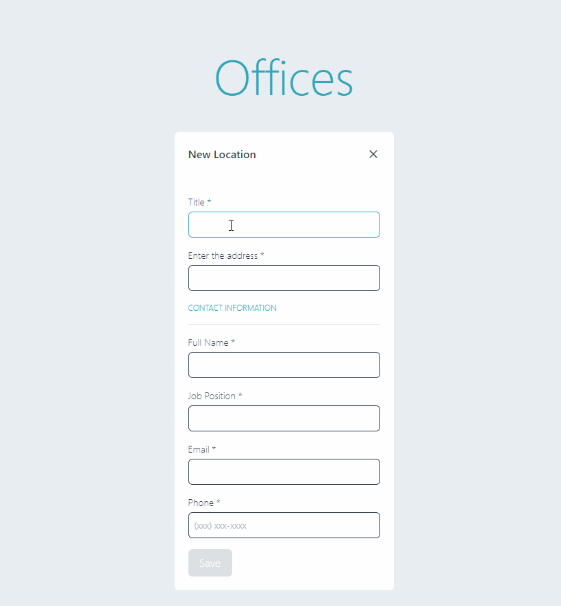

## Getting Started

Install packages: 

```bash
yarn install
```

Run the development server:

```bash
yarn dev
```

Run cypress integration test

```bash
yarn cypress
```

### Project screen shot

